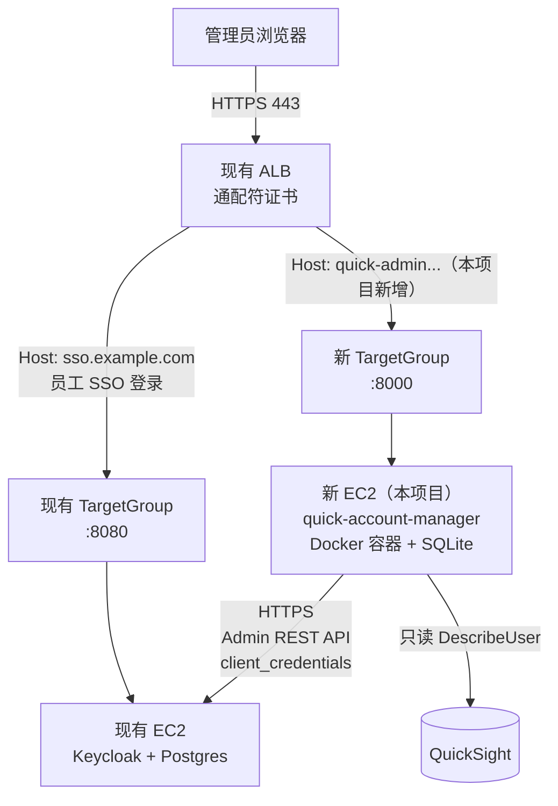

# quick-account-manager 架构文档

本文档描述系统的**现状架构**（组件、数据流、部署拓扑），供开发/运维查阅。每个设计决策
背后的取舍理由、被推翻过的方案，见 [`design.md`](design.md)——两份文档不重复维护同一
件事：这里只回答"现在长什么样"，`design.md` 回答"为什么长成这样"。

## 1. 一句话架构

FastAPI 单体应用（服务端渲染，SQLite 单表持久化）+ Keycloak（身份源 + 用户数据源）+
QuickSight（只读订阅状态核对），部署在一台独立 EC2 上，复用现有生产 ALB 做流量入口。
应用本身**不维护用户数据的本地副本**——Keycloak 是唯一真相源，应用只持久化一张审计
日志表。

## 2. 部署拓扑



两台 EC2 是完全独立的故障域：本项目的 bug/资源占用不影响生产 SSO 链路，也不需要改动
现有生产 CloudFormation 栈。详见 [`design.md` 3 节](design.md#3-部署架构)。

## 3. 应用内部分层

```
app/
├── api/          路由层，只做「校验登录态 → 调用 services → 渲染模板/重定向」
│   ├── auth.py       Keycloak OIDC 登录（Authorization Code）
│   ├── users.py       建号 / 批量建号 / 重置密码 / 档位变更 / 停用启用 / 删除 / 列表 / 导出
│   ├── audit.py       审计日志查询（带过滤）
│   └── health.py       ALB 健康检查，不探测下游 Keycloak
├── services/     业务逻辑层，路由层不直接调 httpx/boto3
│   ├── keycloak_client.py   Admin REST API 的 token 获取/缓存/401 重试
│   ├── keycloak_service.py  建号/改档位/停用/删除等业务规则 + 安全护栏
│   ├── batch_import.py      xlsx 解析校验 + 模板生成
│   ├── export_service.py    用户清单导出 xlsx
│   ├── quicksight_service.py 订阅状态只读核对
│   └── audit_service.py     审计日志写入（容错，见 §6）/ 查询
├── models/       audit_log.py —— 唯一持久化的表
├── templates/    Jinja2，服务端渲染，无前端构建链
├── static/       原生 JS（表格搜索、批量操作、异步订阅状态、批量建号 SSE 渲染）
└── core/         config（环境变量+启动期弱密钥校验）/ db / security（session）/ deps（依赖注入）
```

路由层统一用 `run_in_threadpool` 包裹所有 `KeycloakService`/`QuickSightStatusChecker`
调用——这两个 client 内部是同步 `httpx`/`boto3`，直接在 `async def` 路由里调用会独占
事件循环线程，Keycloak 响应变慢时会连 `/health` 这种无关请求都被拖慢。

## 4. 关键数据流

### 4.1 管理员登录

```
浏览器 → GET /auth/login → 302 到 Keycloak Authorization Code 端点
     → 管理员在 Keycloak 登录页认证
     → Keycloak 302 回 /auth/callback（带 code）
     → 应用换 token，读 userinfo 里的 groups claim
     → 校验 /quick-admin-pro ∈ groups，成立则写 session，否则跳 /auth/forbidden
```

`groups` claim 依赖 Keycloak OIDC client 上配置的 Group Membership mapper——这是部署
前置依赖，不是代码逻辑，见 [`deployment.md`](deployment.md#6-keycloak-前置配置人工一次性)。
没有这个 claim，`app/api/auth.py` 采用 fail-closed：宁可拒绝所有人登录，也不假装权限
检查通过。

### 4.2 建号（单人）

```
POST /users/create → KeycloakService.create_user()
  → POST /admin/realms/quick/users（建号）
  → PUT /admin/realms/quick/users/{id}/groups/{groupId}（加组）
  → 加组失败 → 自动回滚删除刚建的账号（回滚也失败则抛 PartialFailureError，
     路由层用红色 flash 提示"需要人工处理"，不静默吞掉）
→ 成功后一次性渲染密码（secret_result.html），不落库，刷新页面即不可再查看
→ audit_service.record() 记一条 CREATE_USER
```

两步调用（而不是 `add_single_user.py` 原来用的 `partialImport` 一次性接口）是因为
`manage-users` 权限粒度打不动 `partialImport`（403），细节见
[`design.md` 4.2 节](design.md#42-建号逻辑)。

### 4.3 用户列表 + 订阅状态异步加载

```
GET /  → 只查 Keycloak GET /admin/realms/quick/users，秒开
       → 订阅状态列先渲染"查询中…"占位
浏览器 → 页面加载完后另发 GET /users/subscription-status
       → 后端并发（线程池，32 workers）查每个有角色用户的 QuickSight DescribeUser
       → 前端 JS（subscription-status.js）按 user_id 回填状态列
```

拆成两次请求是为了避免 QuickSight 查询（几十人时可能到 3-8 秒）拖慢首屏；订阅状态本身
只是核对用，不是建号流程的必经步骤（订阅由 `QuickSubscriptionAssignFunction` Lambda
异步生效，见 §5）。

### 4.4 批量建号（SSE 进度）

```
GET  /users/batch-create/template  → 下载 xlsx 模板（表头+示例+role列下拉校验）
POST /users/batch-create           → 上传 xlsx，只解析校验，不建号，渲染预览页
POST /users/batch-create/confirm   → 预览页确认后，StreamingResponse (SSE)
                                       逐行建号，每完成一人推一条事件
                                       （created / skipped / failed / partial_failure）
```

刻意逐行顺序调用、不并发——量小（几十人）、每人两次写调用带自动回滚，顺序调用更容易
保证结果、SSE 事件、审计日志三者对得上号。不用标准 `EventSource`（只支持 GET），前端
用 `fetch` + `ReadableStream` 手动解析。

### 4.5 档位变更 / 停用 / 硬删除的安全护栏

所有会改变 `/quick-admin-pro` 组成员或账号可登录状态的操作，都过以下两层护栏
（`app/services/keycloak_service.py`）：

| 护栏 | 触发条件 | 效果 |
|---|---|---|
| `LastAdminGuardError` | 操作会导致 `/quick-admin-pro` 组人数变成 0 | 拒绝执行 |
| `SelfLockoutError` | 管理员试图对自己执行改档位/停用/删除 | 拒绝执行，提示找另一位管理员操作 |
| `MustDisableFirstError` | 硬删除一个 `enabled: true` 的账号 | 拒绝执行，要求先停用 |

硬删除额外要求前端表单二次输入目标邮箱，后端逐字核对（不接受模糊匹配），比"停用"多
一层人工确认。详见 [`design.md` 4.5 节](design.md#45-订阅档位变更与账号停用)。

## 5. 外部依赖与集成点

| 依赖 | 用途 | 权限范围 | 调用方式 |
|---|---|---|---|
| Keycloak Admin REST API | 建号/改组/停用/删除/查用户 | `quick` realm 内 `manage-users`/`query-users`/`query-groups`/`view-users`（confidential client + `client_credentials`，token 必须实际带到这些 roles） | `app/services/keycloak_client.py`（token 缓存 + 401 重试） |
| Keycloak OIDC | 管理员登录 | 无额外权限，只读 `groups`/`email`/`name` claim | Authorization Code（`authlib`） |
| QuickSight `DescribeUser`/`DescribeAccountSubscription` | 核对订阅是否已生效 | 只读，`Resource` 限定到本账号 | `boto3`，线程池并发 |
| `QuickSubscriptionAssignFunction`（Lambda，非本项目代码） | 用户首次登录时把 Keycloak 组映射成实际 QuickSight 订阅 | 不属于本应用，本应用只能核对结果、不能触发或代替 | 异步，监听 CloudTrail `CreateUser` 事件 |

建号/改档位这类**写操作全部走 Keycloak REST API，不经过 AWS API**——AWS 侧只有只读
的 QuickSight 权限，缩小这台实例对 AWS 账户的影响半径。

## 6. 数据模型

唯一持久化表：`audit_log`（SQLite，`app/models/audit_log.py`）。

| 列 | 说明 |
|---|---|
| `actor_email` | 操作人邮箱（登录态里的 email） |
| `action` | 枚举：`create_user`/`reset_password`/`change_tier`/`disable_user`/`enable_user`/`delete_user`/`export_users` |
| `target_email` | 目标用户邮箱（查不到用户时退化成 `user_id=xxx`） |
| `target_name` | 中文姓名，仅 `create_user` 填 |
| `detail` | 角色档位等附加信息；`delete_user` 记被删账号的原角色档位，便于事后重建 |
| `success` / `error_message` | 操作结果 |
| `created_at` | UTC 时间戳 |

`audit_service.record()` 写库失败时内部 `try/except` 兜底（`db.rollback()` + 记 error
级别日志），不向上抛异常——批量操作场景下一条审计写失败不该打断整个 for 循环，代价是
极端情况下审计记录可能漏记，这是刻意的取舍，见 [`design.md`](design.md) 2026-08-24 那条记录。

密码**不落库**：建号/重置密码返回体里带一次性明文密码，前端展示后不再请求，后端只记
"已生成，已展示"这个事实（即一条 `success=true` 的审计记录）。

## 7. 安全边界小结

- 新 EC2 不对公网暴露任何入站端口，只有 ALB 的 SecurityGroup → 8000 一条规则
- 不开 SSH，运维走 SSM Session Manager
- Keycloak 凭证权限收窄到 `quick` realm 内的 `manage-users`/`query-users`/`query-groups`/`view-users`，不持有 `manage-realm`
- 两个 Keycloak client 职责分离：一个只登录鉴权（OIDC），一个只调 Admin API（`client_credentials`）
- 所有 secret（两个 client secret + session secret）走 SSM Parameter Store（SecureString），生产环境启动时校验长度 ≥ 32 位且不是占位符，否则拒绝启动（`app/core/config.py`）
- 会改变管理员组成员的操作有 `LastAdminGuardError`/`SelfLockoutError` 双重护栏（§4.5）
- 硬删除要求「先停用」+「二次输入邮箱确认」，比停用多一个量级的确认成本

## 8. 技术栈

FastAPI + Jinja2（服务端渲染，无前端构建链）+ SQLAlchemy + Alembic + SQLite + `authlib`
（OIDC）+ `boto3`（QuickSight 只读）+ `openpyxl`（xlsx 解析/生成）。容器化部署（Docker），
CloudFormation 声明式基础设施。选型理由（例如为什么不用 React/Vite、为什么不上 RDS）见
[`design.md`](design.md)。

## 9. 相关文档

- [`design.md`](design.md) —— 完整设计决策记录，含每一次范围变更的时间线和理由
- [`deployment.md`](deployment.md) —— 部署与测试手册
- [`user-guide.md`](user-guide.md) —— 面向管理员的操作手册
